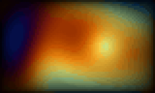

# terminal-animations

[](LICENSE)

A Claude Code plugin for **authoring beautiful terminal animations** — ASCII/ANSI
motion of any kind, for splash screens, loaders, demos, or just delight.

It turns Claude into an expert at terminal motion: when you ask for an animation, it
**interrogates the vision**, **composes** technique and style into something past the
conventional default, builds it to a tested convention, and finishes at a beauty gate —
encoding the hard-won craft of terminal motion so a new animation starts *good* rather
than random.



*The bundled [reference animation](examples/plasma): a pure, deterministic half-block
plasma — designed palette, orbiting focus, edge vignette — tuned at the beauty gate.*

## Why a skill, not a snippet

The default answer to "make a cool terminal animation" is one effect, in flat 1×1 ASCII
glyphs, with functional colour — competent and forgettable. A *mesmerizing* one is
composed: a deliberate fidelity tier, a designed palette, layered effects, tuned by eye.
The skill exists to get the second thing, every time.

It carries four references, pulled in as a job needs them:

- **`craft.md`** — the universal motion/beauty rubric (why motion reads: leading edge +
  trail, negative space, the two brightness channels, tune-by-looking).
- **`techniques.md`** — the technical palette: the sub-cell **resolution ladder**
  (half-block → sextant → octant → braille), colour depth, and dithering.
- **`effects.md`** — the demoscene/prior-art catalog (plasma, tunnel, fire, starfield,
  donut, Life, rain…) as springboards to *combine*, not copy.
- **`tools.md`** — the ecosystem: providers and build-time tools (chafa, notcurses,
  ffmpeg…), with **fresco** as one Go generative-field provider among them.

## The target: where an animation lives

Routing is one early step, not the whole skill. Field-shaped effects have a home:

| If the animation is… | It belongs in… |
|---|---|
| full-pane, a pure function of `(position, frame)`, gradient-coloured, loops forever, no subject | **a [fresco](https://github.com/ZviBaratz/fresco) field variant** (when you're in the fresco repo) |
| stateful (a sim), has a subject/sprite, *resolves* (a one-shot), or is non-field motion | **a standalone animation** |

For a fresco variant *inside the fresco repo*, the plugin defers to fresco's own
`new-variant` skill — an instruction-level hand-off, never a duplicate of fresco's
contract. Everything else is authored here, to a small deliberate convention.

## The standalone convention

Chosen from real examples, not guessed — and the deliberate seed of a possible future
library:

```go
// pure, free-running (a plasma, a starfield): frame N from N alone
func Frame(w, h, tick int) string

// stateful or resolving (game of life, a typewriter, a wipe):
type Animation interface {
    Update(tick int)      // advance state to the absolute frame `tick`
    View(w, h int) string // render current state to exactly h lines of w cells
    Done() bool           // true once a one-shot has resolved; always false for a loop
}
```

A pure `Frame` requires closed-form-of-`tick`, loops-forever, and no carried state;
anything that resolves (needs `Done()`) or carries state is an `Animation`. Plus a
`cmd/preview/main.go` loop to watch it, and a test pinning the `h×w` contract, no-panic
on any `(w, h, tick)`, determinism where pure, and a golden frame.

## What's inside

- `skills/author-animation/` — the authoring skill and its four references.
- `scripts/` — the tuning harness: a live preview runner (`preview.sh`), a frame dumper,
  `ansi2png.py` — a headless colour gate that rasterizes frames to a PNG when there's no
  terminal (a sandbox, CI, an agent) — and two recorders: `record-headless.sh` (GIF +
  MP4 with only `ffmpeg` + `python3`) and `record.sh` (the vhs path, which additionally
  needs `vhs` and `ttyd`).
- `agents/tuner.md` — an optional subagent that drives the render → look → tune loop.
- `examples/` — four **reference animations**, each built to the standalone convention
  with its own preview, golden test and demo GIF. Three climb the resolution ladder; the
  fourth shows composing with the ecosystem:
  - [`plasma/`](examples/plasma) — a half-block truecolor plasma (free-running).
  - [`nebula/`](examples/nebula) — a half-block drifting nebula field (seamless loop).
  - [`torus/`](examples/torus) — a **braille** 3D wireframe torus with hidden-line
    removal (seamless loop) — the top rung, where the dot mask carries geometry and
    colour carries depth.
  - [`embers/`](examples/embers) — warm embers drifting over a **[fresco](https://github.com/ZviBaratz/fresco)**
    galaxy, coupled so the embers catch the field's light: the worked example of
    **building on a provider** instead of reimplementing it (free-running).

## Install

```
/plugin marketplace add ZviBaratz/terminal-animations
/plugin install terminal-animations@zvibaratz
```

Then just ask for an animation ("a mesmerizing plasma splash", "a hyperspace intro", "a
new fresco variant") — the `author-animation` skill triggers on its own.

## Scope

In scope: producing a tested, tuned, self-contained animation plus a preview, using the
ecosystem's techniques and build-time tools. Out of scope (for now): wiring it into a
specific app's splash/cycling harness (a separate step); **runtime** multi-tool
pipelines and graphics-protocol pieces (sixel/kitty — a deliberate future door, kept
open by the self-contained convention); runtime LLM generation (never put a model in a
60fps render loop); and building a standalone animation *library/registry* now.

## License

MIT © Zvi Baratz
