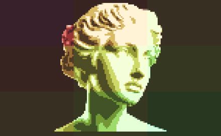

# bust — a classical bust as a Warhol pop-art grid



> **Full fidelity:** the GIF above is 256-colour; the truecolor 24-bit capture is
> [`docs/bust.mp4`](../../docs/bust.mp4) — closer to what the live terminal shows.

<video src="../../docs/bust.mp4" width="560" autoplay loop muted playsinline>
  Inline video isn't supported here —
  <a href="../../docs/bust.mp4">watch or download <code>docs/bust.mp4</code></a>.
</video>

A looping terminal animation that treats a marble bust as a **silkscreen source**: the same
head tiled in a 3×3 grid, each panel in a bold flat pop colorway, with a diagonal wave of
recoloring rippling across the grid forever. It is the author-animation skill's "**silkscreen
the subject, cycle the palette**" pattern (`references/palette-cycle-kit.md`, `tools.md`
§Baking): the bust's luminance is matted and baked once; all the color, and all the motion,
is a pure function of `tick` in Go. Nothing is installed to run it.

## Why this, and not a "realistic" bust

The first two cuts of this example chased photographic realism — a matted still panned in an
ellipse, then a pseudo-3D turn under a moving light — and both fell flat. The lesson is about
the medium: **a terminal is bad at subtle and spectacular at bold.** At half-block resolution
the marble's gentle gradients collapse into banded hair and a muddy color cast. Flat,
high-contrast, saturated color is exactly what truecolor half-blocks do best. So we stop
rendering the marble accurately and *screenprint* it — posterize its luminance into four flat
tones and recolor them, the way Warhol silkscreened Marilyn. The classical form, no longer
fighting the medium, becomes the asset.

## Vision Card

- **Subject** — a classical marble bust as a silkscreen source: one luminance + alpha matte,
  posterized to four flat tones. No 3D, no relighting.
- **Motion verb** — *rippling*. A diagonal wave of recoloring sweeps the 3×3; the geometry
  never moves.
- **Light** — none. Flat pop-art color fields; the marble's own tonal map drives the
  posterization, not a runtime light.
- **Atmosphere** — none. Clean flat panels, thin near-black gutters, a framed gallery grid.
- **Palette** — nine curated Classic-Warhol-pop colorways (a flat background plus four
  luminance-band inks each), electric and deliberately clashing.
- **The one special idea** — a classical bust reborn as a Warhol silkscreen grid, a diagonal
  color wave sweeping the nine panels seamlessly.

## What it demonstrates

- **Silkscreen the subject, cycle the palette.** `clean.py` bakes *only* the bust's luminance
  and silhouette (`bust_lum.png`). `bust.go` posterizes that luminance into four bands and
  maps each band — and the silhouette's background — to a colorway ink, per panel, per tick.
  All the drama is color, computed live; the subject is a still. This is the fix for this
  example's earlier cuts, which were the anti-pattern for the medium: a photograph given a
  camera move, subtle where the terminal wanted bold.
- **Motion is color, not geometry.** The grid is frozen. Each panel crossfades through the
  nine colorways, indexed by a continuous phase **plus its diagonal position** `(gx+gy)`, so
  the recoloring reads as a wave travelling across the grid. Two quarter-phase sinusoids would
  be an ellipse; *this* is a directed wave.
- **Hue-aware crossfades.** Blending two clashing colorways in RGB passes through gray mud. So
  the crossfade interpolates in HSV along the shorter hue arc, keeping saturation and value
  high — the transition sweeps through vivid hues instead of desaturating. This is what keeps
  the ripple *pop* rather than muddy.
- **A matte that keeps the whole subject, then a clean luminance ramp.** The bust is white
  marble on a white field — the hard case. `clean.py` floods only near-pure-white (so lit
  marble that touches the frame isn't eaten) and keeps every component above a size floor (so
  a highlight can't split off the shoulders). It then contrast-stretches the marble's own
  narrow tonal range to fill the ramp, so the face reads once posterized, and de-speckles the
  faint stock watermark so it can't surface as a band edge. `TestAsset` guards the matte
  didn't collapse; `TestPopArt` guards the palette and grid didn't.
- **A composition robust to any pane.** Each head is *contained* in its panel (letterboxed,
  with a small fill so it dominates like a real portrait), so the whole face reads whether the
  pane makes the panels wide or tall; the flat background fills the margins as a color field.
- **Fidelity tier — half blocks.** Every cell is a `▀`: foreground paints the upper pixel,
  background the lower, so the visible grid is `w × 2h` independent 24-bit pixels.
- **A seamless forever-loop.** The colorway index advances by exactly `len(colorways)` over
  one `period`, so `Frame(w,h,0)` and `Frame(w,h,period)` are **byte-identical** — pinned by
  `TestLoopSeam`.
- **Determinism.** `Frame(w, h, tick)` is pure — no wall clock, no `math/rand`. Tests pin the
  `h×w` contract, no-panic on any `(w, h, tick)`, byte-stability, the seam, that consecutive
  frames move, the decoded-asset integrity, the pop-art palette/grid, and a golden.

## Run it

```sh
cd examples/bust
go run ./cmd/preview                    # live, in colour (Ctrl-C to quit — cursor is restored)
go run ./cmd/preview frames 5           # dump 5 frames (structure + colour check)
go test ./...                           # shape, no-panic, determinism, loop-seam, motion, golden

# headless colour gate (no TTY needed): rasterize a filmstrip to a PNG and look at it
go run ./cmd/preview frames 6 40 150 46 | ../../scripts/ansi2png.py --cw 4 --ch 4 > /tmp/bust.png
```

## Re-baking the asset

`bust_lum.png` is committed, so nothing below is needed to *run* the animation — only to
regenerate the luminance matte from a different source.

```sh
cd examples/bust
python3 clean.py ~/Downloads/bust.png bust_lum.png   # matte → luminance+alpha asset
go test ./... -run TestGolden -update                 # asset changed ⇒ refresh the golden
```

`clean.py` needs `python3` + Pillow on `PATH` (author-time only). The **palette** and **motion**
constants (the colorways, `period`, `fill`, `vPlace`, the posterization) live in `bust.go` and
are documented in `references/palette-cycle-kit.md` — all swept **by eye** against the
`ansi2png` filmstrip, per the plugin's "tune by looking, not arithmetic" loop. Posterization is
unforgiving of a stock watermark, so `clean.py` de-speckles it and the emitted asset is
verified watermark-free before committing; the watermarked source is **never copied into the
repo**, only the clean `bust_lum.png` ships.

## How the demo media was made

The plugin's own headless recorder, `scripts/record-headless.sh` — no `vhs` required:

```sh
# a lean README GIF (one full loop) and the truecolor MP4
../../scripts/record-headless.sh -o ../../docs/bust --no-mp4 --fps 20 --width 440 -- \
  go run ./cmd/preview frames 40 6 150 46
../../scripts/record-headless.sh -o ../../docs/bust --no-gif --fps 30 --width 600 -- \
  go run ./cmd/preview frames 120 2 150 46
```

Because the animation is a seamless loop, the GIF loops with no ping-pong. Flat pop color
fields compress far better as a 256-colour GIF than the old photographic content did, but the
truecolor [`docs/bust.mp4`](../../docs/bust.mp4) still renders the hue-sweep most faithfully.
