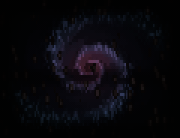

# embers — composing with the ecosystem



The example that **builds on another package instead of reimplementing it**: a foreground
effect of this repo's own — a sparse drift of warm embers — layered over a background
galaxy generated by the **[fresco](https://github.com/ZviBaratz/fresco) provider**, and
*coupled* so the two read as one lit scene rather than two stacked ones.

It exists to answer a fair criticism: the plugin **documents** combining tools
([`references/tools.md`](../../skills/author-animation/references/tools.md)) far more than
it **demonstrates** it. `plasma`, `nebula` and `torus` are pure stdlib maths; `embers`
imports `github.com/ZviBaratz/fresco` and composes on top of it — the worked proof of
`tools.md` §"Providers" and `SKILL.md` §3.

## What it demonstrates

- **A provider for the background, not a reimplementation.** The galaxy — bulge, spiral
  arms, dust lane, warm-core/cool-rim palette — is fresco's `Render(w, h, tick, Galaxy)`,
  not maths rewritten here. That is the "**don't rebuild rain / tunnel / ripple / galaxy**"
  rule (`SKILL.md` red flags) followed literally: reach for the provider.
- **Building on rendered output.** fresco's public surface is a finished ANSI *string*, so
  `embers` does what you do to compose on **any** such provider: **parse it back to a cell
  grid, composite, re-emit** (`parseField` in `embers.go`). fresco emits a regular
  foreground-only truecolor grammar, which makes the decode cheap and robust — anything
  unrecognised degrades to empty sky, so the `h×w` contract always holds.
- **Layering with intent.** The galaxy is *dimmed* (`frescoDim`) into a recessed wash so it
  sits behind; the embers are composited in front. A slow field wash behind a foreground of
  particles, tied by a focal **vignette** — the "layer" move from `SKILL.md` §3.
- **Coupling — the idea a generic "field + particles" lacks.** An ember doesn't just sit on
  the galaxy, it **catches its light**: where it crosses a bright arm it flares (brightness
  lifted by the field luminance beneath — `glowCouple`) and takes on a tint of the arm's
  colour (`hueCouple`). The two layers are **driven by each other** — "drive one effect with
  another" (`SKILL.md` §3), made literal — and it's the one idea that turns a stack into a
  scene.
- **Fidelity tier — kept as fresco's.** fresco paints one truecolor glyph per cell (its
  density ramp `·:+=*oO0` *is* a second brightness channel), with no sub-cell detail to
  promote to half-blocks. So `embers` composites in the glyph+foreground-colour tier rather
  than fighting the provider's model — an ember's brightness rides **both** channels (a
  hotter ember gets a fuller glyph *and* a gold-white colour). The climb past the default
  here is the **composition**, not the spatial rung.
- **Determinism.** `fresco.Render` is pure when its `Profile` is pinned (`TrueColor`), and
  the ember layer takes animation only through `tick` and randomness only through an integer
  coordinate hash — never `math/rand` — so `Frame(w, h, tick)` is pure and snapshot-testable.
- **Free-running, not a seamless loop** — like [`plasma`](../plasma), unlike
  [`nebula`](../nebula). The galaxy and the ember drift both advance linearly with `tick`, so
  it moves forever but never *exactly* repeats. Hence no `TestLoopSeam` (no seam to pin), and
  its demo GIF is **ping-ponged** (below).

It follows the skill's §B convention exactly: a pure `func Frame(w, h, tick int) string`, a
`cmd/preview/` copied from `scripts/preview/`, and a test — plus two tests with *teeth* on
the composition itself (`TestFieldLayerPresent`: the provider really lit the field;
`TestEmberLayerSparse`: the foreground is really there and stays sparse). Rip either layer
out and the matching test goes red.

## Run it

```sh
cd examples/embers
go run ./cmd/preview            # live, in colour (Ctrl-C to quit — cursor is restored)
go run ./cmd/preview frames 5   # dump 5 frames (structure + colour check)
go test ./...                   # bounds, no-panic, determinism, both layers, golden

# headless colour gate (no TTY needed): rasterize frames to a PNG and look at it
go run ./cmd/preview frames 6 18 100 40 | ../../scripts/ansi2png.py > /tmp/embers.png
```

Unlike the other examples, this module has a dependency (`github.com/ZviBaratz/fresco`),
so it ships a `go.sum`; `go test` / `go run` fetch fresco from the module proxy on first use.

## How the demo GIF was made

`docs/embers.gif` was produced with the plugin's **own** headless pipeline — no `vhs`:
dump frames → rasterize each with `ansi2png.py` → assemble with `ffmpeg` using **Bayer**
(ordered) dithering, stable under motion. Because embers is free-running — it never closes
back on an earlier frame — the frames are **ping-ponged** (played forward then reversed) to
hide the seam, exactly as [`plasma`](../plasma) is. A true θ-loop like
[`nebula`](../nebula) needs no ping-pong.

## Tuning notes

The taste constants at the top of `embers.go` were swept and picked **by eye** against the
`ansi2png` filmstrip. The most instructive lesson is baked into the code: the first cut used
a dark amber for the embers and they **vanished** — because `ansi2png` (like a real terminal)
weighs a glyph by its *ink coverage*, so a small dark-amber `.` is almost nothing. Real
embers have white-hot cores; the fix was a warm→**gold-white** ramp (`emberCool`→`emberHot`)
plus a brightness floor, so a mote reads as a point of *light*. Exactly the "watch it move,
in colour — the formula won't tell you" loop the plugin preaches.
