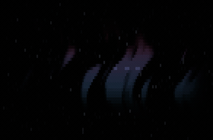

# saucer — composing with the ecosystem



The example that **builds on another package instead of reimplementing it**: a hand-authored
subject of this repo's own — a cartoon flying saucer — drifting across a background night sky
generated by the **[fresco](https://github.com/ZviBaratz/fresco) provider**, and coupled so the
two read as one scene: the saucer lights the sky beneath it, and on some passes lowers a tractor
beam the aurora and stars show through.

It exists to answer a fair criticism: the plugin **documents** combining tools
([`references/tools.md`](../../skills/author-animation/references/tools.md)) far more than it
**demonstrates** it. `plasma`, `nebula` and `torus` are pure stdlib maths; `saucer` imports
`github.com/ZviBaratz/fresco` and composes on top of it — the worked proof of `tools.md`
§"Providers" and `SKILL.md` §3.

## What it demonstrates

- **A provider for the background, not a reimplementation.** The aurora sky — its flowing
  blue/pink light-curtains — is fresco's `Render(w, h, tick, Aurora)`, not maths rewritten here.
  That is the "**don't rebuild rain / tunnel / ripple / galaxy**" rule (`SKILL.md` red flags)
  followed literally. *(An earlier cut used fresco's **Galaxy** field — but a galaxy is a smooth,
  subtle, low-contrast subject, which renders as mud in coarse glyphs. Aurora is **directional**,
  so it reads. The lesson, now in `craft.md`: **choose the subject to the medium, not against it** —
  a cell grid loves bold contrast and motion, not soft gradients.)*
- **Building on rendered output.** fresco's public surface is a finished ANSI *string*, so `saucer`
  does what you do to compose on **any** such provider: **parse it back to a cell grid, composite,
  re-emit** (`parseSky` in `saucer.go`).
- **A subject with character, chosen to the medium.** A crisp, bold sprite is exactly what a cell
  grid renders well — a silver disc, a cyan canopy, blinking underlights. It gives the eye something
  to *watch* (`craft.md`: coherent global motion reads as intent) and the whimsy is the "one idea
  the generic version lacks" (`SKILL.md` §1).
- **Coupling — the saucer belongs to the sky.** It isn't pasted on top: it **lights the sky beneath
  it** (a soft glow halo) and, on some passes, lowers a **tractor beam** — a translucent cone the
  aurora and stars show through. The subject drives the field — "drive one effect with another"
  (`SKILL.md` §3).
- **Depth behind the subject.** A sparse field of faint **twinkling stars** fills the dark sky
  between the curtains, so the night has depth even when the saucer is away.
- **Never a loop you can feel.** Each pass is deterministically **varied** — a different height,
  speed, direction, and whether it trails a beam — with long empty gaps between, so the sky is
  mostly quiet and a flyby is an *event*, not a metronome.
- **Determinism.** `fresco.Render` is pure when its `Profile` is pinned (`TrueColor`), and every
  other layer — the saucer's whole timeline, the stars' twinkle, the beam — takes animation only
  through `tick` and randomness only through an integer coordinate hash, never `math/rand`. So
  `Frame(w, h, tick)` is pure and snapshot-testable, *even though it has a moving subject*: the
  saucer's position is a closed form of `tick` (see `flightAt`).
- **Free-running, not a seamless loop** — like [`plasma`](../plasma), unlike [`nebula`](../nebula).
  Time is linear, so it drifts forever but never *exactly* repeats. Hence no `TestLoopSeam`; its
  demo starts and ends on quiet sky so it loops cleanly anyway (below).

It follows the skill's §B convention exactly: a pure `func Frame(w, h, tick int) string`, a
`cmd/preview/` copied from `scripts/preview/`, and a test — plus tests with *teeth* on the
composition itself:

- `TestSkyLayerPresent` — the fresco aurora really lit the sky.
- `TestSaucerComesAndGoes` — the saucer is on screen for *some* ticks of a pass and absent for
  others (a flyby, not a fixture, not a no-show), and successive passes genuinely differ.
- `TestSaucerPaints` — when on screen the saucer paints its solid-block hull (a glyph nothing else
  emits); when absent, that glyph is nowhere in the frame.
- `TestStars` — the star lattice is sparse *and* twinkles.

Rip out a layer and the matching test goes red.

## Run it

```sh
cd examples/saucer
go run ./cmd/preview            # live, in colour (Ctrl-C to quit — cursor is restored)
go run ./cmd/preview frames 5   # dump 5 frames (structure + colour check)
go test ./...                   # bounds, no-panic, determinism, all layers, golden

# headless colour gate (no TTY needed): rasterize frames to a PNG and look at it.
# The saucer flies mid-slot, so dump across a pass to catch it:
go run ./cmd/preview frames 40 12 132 44 | ../../scripts/ansi2png.py > /tmp/saucer.png
```

Unlike the other examples, this module has a dependency (`github.com/ZviBaratz/fresco`),
so it ships a `go.sum`; `go test` / `go run` fetch fresco from the module proxy on first use.

## How the demo GIF was made

`docs/saucer.gif` was produced with the plugin's **own** headless pipeline — no `vhs`:
dump frames → rasterize each with `ansi2png.py` → assemble with `ffmpeg` using **Bayer**
(ordered) dithering, stable under motion. The dump spans exactly one pass *slot* — quiet starry
sky → the saucer flyby (this pass beams) → quiet sky — so it **loops cleanly forward** with no
ping-pong, since both ends are quiet night. (A free-running field with no such quiet frame is
ping-ponged instead, as [`plasma`](../plasma) is; a true θ-loop like [`nebula`](../nebula) needs
neither.)

## Tuning notes

The taste constants at the top of `saucer.go` were swept and picked **by eye** against the
`ansi2png` filmstrip. Two lessons are baked into the code:

- **Choose the subject to the medium.** This example began as a fresco **galaxy** with a coupled
  particle layer, and no amount of constant-tuning made it pretty — a galaxy is smooth, subtle and
  low-contrast, which is exactly what a coarse glyph grid renders worst. Swapping to **aurora** (a
  bold, directional field) and a **crisp cartoon sprite** — the two things a cell grid renders
  *well* — is what made it read. The composition and subject choice, not the knobs, were the fix.
- **A dark dot vanishes; give it light.** The stars and the saucer are bright points against a
  deepened night (`auroraGamma`) precisely because `ansi2png` (like a real terminal) weighs a glyph
  by its *ink coverage* — a faint dot is almost nothing. Both are the "watch it move, in colour —
  the formula won't tell you" loop the plugin preaches.
