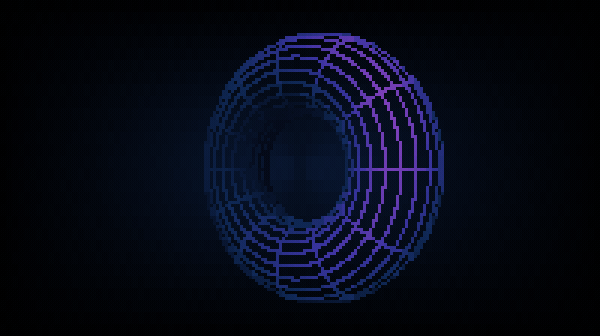

# torus — a spinning 3D wireframe torus in braille



> **Full fidelity:** the GIF above is 256-colour; the truecolor 24-bit capture is
> [`docs/torus.mp4`](../../docs/torus.mp4) — what the live terminal actually shows.

<video src="../../docs/torus.mp4" width="600" autoplay loop muted playsinline>
  Inline video isn't supported here —
  <a href="../../docs/torus.mp4">watch or download <code>docs/torus.mp4</code></a>.
</video>

A standalone splash-screen animation: a pure, deterministic **braille** wireframe torus
that tumbles about two axes, removes its own hidden lines, and loops forever with no
seam. It follows the skill's §B convention (a pure `Frame(w, h, tick)`) and is this
repo's worked example of the **top rung of the resolution ladder**.

## What it demonstrates

- **Fidelity tier — braille.** Every cell is a `U+2800`-block glyph carrying a **2×4
  grid of individually addressable dots**, so the visible grid is `2w × 4h` — the finest
  *monochrome* rung from `references/techniques.md`. That reference argues the rungs
  above half-block buy sharper hard **edges** rather than smoother colour, which is
  exactly why a **wireframe** belongs up here and a smooth colour field does not. A
  terminal cell is roughly 1×2, so a braille dot is very nearly **square** — both axes
  are scaled by the same factor and the torus stays circular.
- **The two brightness channels, split cleanly.** A braille cell is *monochrome* —
  eight dots share one foreground colour — so the **dot mask carries pure geometry** and
  **colour carries all the brightness** (`references/craft.md`). Dimming a wire by
  dropping dots would shatter thin lines into noise, so it is never done.
- **Hidden-line removal.** The opaque surface is rasterized into a **per-dot depth
  buffer** that is never drawn; wires survive only where they are in front of it, backed
  by an analytic back-face cull. Without it a wireframe torus is famously ambiguous (the
  Necker-cube effect) and its spin direction visually flips. This is `donut.c`'s
  per-*cell* z-buffer (`references/effects.md`) promoted to per-*dot* by the tier.
- **A designed iridescent palette.** Deep cyan-blue on the receding side → indigo →
  violet → magenta → a hot pink-white near limb, blended with a Lambert `N·L` term on
  the analytic torus normal. **Hue moves with depth**, not just luminance, so the tumble
  reads even where dot density is flat.
- **Composition.** A dim backdrop wash painted as the cell **background** — the one way
  to layer a smooth colour field under a monochrome braille glyph in the same cell —
  times an **edge vignette**, so the splash reads as a window onto something larger.
  The wash is a smooth dim gradient, so it gets motion-stable screen-locked **Bayer**
  dithering; the wires deliberately do not (dithering line art only makes it dashed).
- **A truly seamless forever-loop.** Every time-varying term rides one phase
  `θ = 2π·(tick mod period)/period` at an **integer** harmonic, so `Frame(w,h,0)` and
  `Frame(w,h,period)` are byte-identical — pinned by `TestLoopSeam`.
- **Determinism.** `Frame(w, h, tick)` is pure — no wall clock, no `math/rand`, no
  package-level state. The depth and mask buffers are per-call locals, so it is also
  safe to call concurrently.

## The trap this animation exists to document

A torus tumbled by **integer harmonics about two coordinate axes secretly repeats at
`period/2`.** At that tick the accumulated rotation is a product of π-rotations about
coordinate axes, and *every one of those is a symmetry of the torus* — so the frame
comes back identical and the "24-second loop" is really a 12-second one played twice.
Verified numerically for harmonics 1:2, 1:3, 2:3 and 3:5.

The fixed oblique pre-tilt **`tiltY`** breaks the degeneracy. It is load-bearing, not
decoration, and `TestPeriodIsMinimal` pins it.

That test needs two subtleties to have any teeth, both learned the hard way:

1. It compares the **dot grid with SGR stripped**, not the raw frame. The backdrop wash
   also varies with θ, so a whole-frame comparison differs on the *background* alone and
   passes no matter what the torus does.
2. It asserts a large **fraction** of cells differ, not mere inequality. `sin(π)` is
   `1.22e-16`, not `0`, so even a perfectly degenerate half-period render differs in a
   handful of dots. Measured: the degenerate case differs in **3.8%** of lit cells, the
   real one in **96%** — so a 25% floor separates them with room to spare.

## Run it

```sh
cd examples/torus
go run ./cmd/preview            # live, in colour (Ctrl-C to quit — cursor is restored)
go run ./cmd/preview frames 5   # dump 5 frames (structure + colour check)
go test ./...                   # shape, no-panic, determinism, seam, true period, fit, golden

# headless colour gate (no TTY needed): rasterize frames to a PNG and look at it
go run ./cmd/preview frames 6 120 100 28 | ../../scripts/ansi2png.py --cw 6 --ch 12 > /tmp/torus.png
```

## How the demo GIF was made

`docs/torus.gif` was produced with the plugin's own headless pipeline — no `vhs`
required:

```sh
cd examples/torus
../../scripts/record-headless.sh -o ../../docs/torus --fps 20 --width 600 --cw 6 --ch 12 -- \
  go run ./cmd/preview frames 120 6 100 28
```

`120 × 6 = 720 = period`, so the dump spans exactly one loop and the GIF closes with no
ping-pong.

**Note the small pane and the matching `--width`.** Braille is the one tier where the
recording size really matters: the wireframe *is* the dot pattern, so any downscale
destroys it. A 100×28 pane at 6×12px cells is exactly 600px wide, so `--width 600`
means **no rescale at all**. Recording at nebula's 220×56 and letting ffmpeg scale to
640 would shrink each dot below a pixel and the torus would arrive as a grey haze.

This animation is also why `ansi2png.py` now understands braille at all — see the
CHANGELOG. Before that it collapsed every braille cell to a solid foreground block, so
the headless gate (**and this GIF, which is built through it**) showed a filled blob
instead of a wireframe.

## Tuning notes

Every constant at the top of `torus.go` was swept against the `ansi2png.py` filmstrip
and picked **by eye**. What the sweeps actually rejected:

- **`ringsU` / `ringsV` (12 / 22)** — the first and most important sweep. `16/28` was
  the initial guess and collapses into an unreadable solid mesh below ~60 columns;
  `10/18` reads as loose disconnected bands and the object stops feeling solid. 12/22 is
  the pair that stays legible at 44×13 and still looks like a machined object at 100×28.
- **`shadeGamma` (2.2)** — added only after *measuring* the shade histogram. The raw
  distribution piled up at 0.6–0.9 (most of a front-facing surface is both near-ish and
  lit-ish), which spent the entire palette inside its magenta band: the torus rendered
  as one flat pink mesh with no cyan anywhere. The gamma pulls the mids down into the
  indigo and keeps the hot pink as a rare near-limb highlight.
- **`depthNear` / `depthFar`** — same root cause. Because the back-face cull removes
  everything facing away, the visible surface only spans the *near* part of the object;
  mapping the palette across the full `[-maxR, +maxR]` wastes half the ramp.
- **`fitFrac` (0.86)** and the exact projected-radius bound. The first fit divided by
  the *nearest-point* magnification `persp/(persp−maxR)`, which is far too conservative
  and left the torus filling only ~50% of the pane. The exact worst case over every
  attitude is `maxR·persp/√(persp²−maxR²)` — confirmed against a numeric sweep — which
  recovers that 1.66× and still guarantees `TestFitsPane`.
- **`depthBias` (0.18)** — `0.06` reintroduces z-fighting and the wires break into
  dashes; `0.25` is solid but lets the far side fringe through at the edge-on attitude.

Measured cost, since a two-pass rasterizer invites suspicion: **9.8 ms/frame at 220×56**
and **2.5 ms at 100×28**, comfortably inside the 33 ms budget of the preview's 30 fps —
but only because the occluder's `cos`/`sin` are hoisted into per-frame tables, so the
inner loop is multiply-add with no transcendentals.

There is deliberately **no `TestHiddenLineRemoval`**; `torus_test.go` explains why at
length. The short version: summed over the whole loop at 100×28 the occlusion pipeline
only changes the lit-cell count by ~19%, and its two stages are redundant enough that
disabling either alone moves it ~4% (and on some frames not at all), so any threshold
tight enough to catch a regression would be flaky. Occlusion is a visual property,
checked at the beauty gate.
